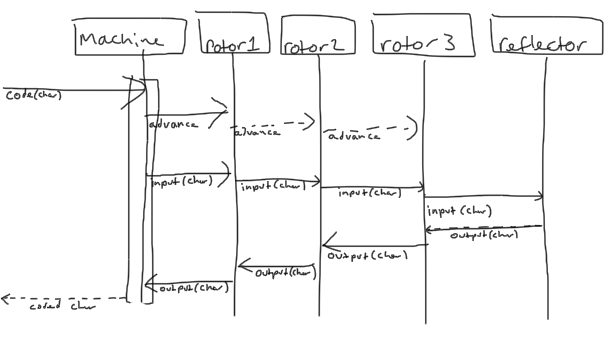

# The Butterfly flaps its wings
## Is TDD complex or simple?

[Steve Freeman]() and [Jamie Dobson]() ran this excellent session at [SC2012]().
They are running it again at [SPA2012]().

Each pair has to program an Enigma machine. They are given some detail on how it
works, and are given a paper machine with which they can generate some
acceptance test data.

By each pair working in their own chosen environment/language, and approaching
the problem in their own way, the hope is that some data around how starting
conditions affect the design of the code.

## Our attempt

I paired up with [Gavin Heavyside](https://twitter.com/#!/gavinheavyside) and
the code that we produced during the session is [here]().

We started off spending some time figuring out how the machine worked, and tried
to model that as a sequence diagram.



We then wrote some high level acceptance tests, based on the information that we
had been given. We checked encoding a single character, decoding a single
character, and checked that a renecoding a decoded message gave back the same
encoded message.

We wrote the acceptance test to give us an idea of the interface that we wanted,
something like:

```ruby
machine = Machine.new Rotor::I.at('M'), Rotor::II.at('C'), Rotor::III.at('K')
machine.call("AMSGFRCDNG")
```

As we were working we discovered that having an operator to deal with the
machine felt more natural. The operator would deal with splitting the message
into individual characters, and recombining the coded characters.

We also added a RotorMechanism, which allowed the machine to treat the rotors
as a black box.

## Result

We managed to get to the point that we were able to code and decode single
characters, we didn't quite get to moving the rotors so we couldn't decode
a message.

We also suspect we have an off by one error, or we have misunderstood part of
the specification, as we were expecting to have to do rotate at least one rotor
just to encode/decode a single character.

Its a great little exercise. If you want to try it your self download the [paper
enigma machine](http://mckoss.com/Crypto/Paper%20Enigma.pdf).
